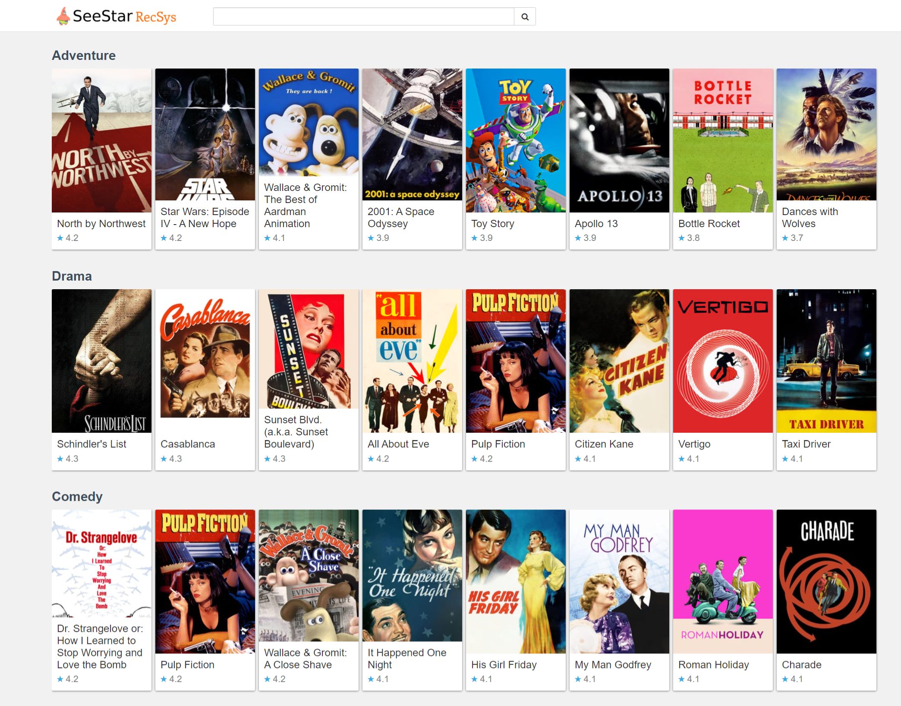
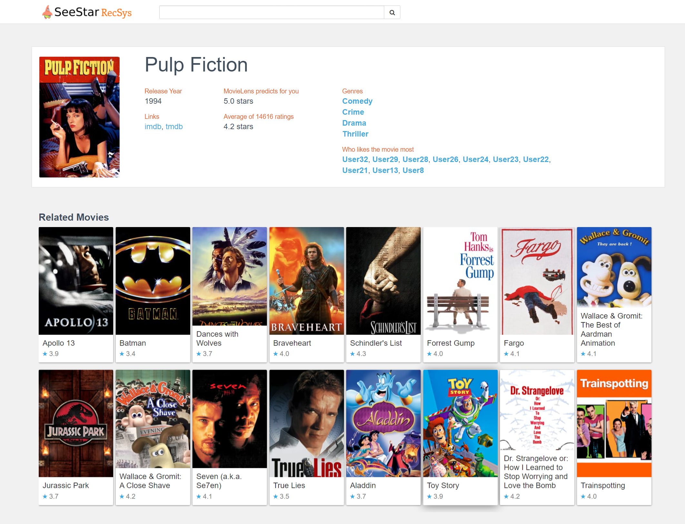
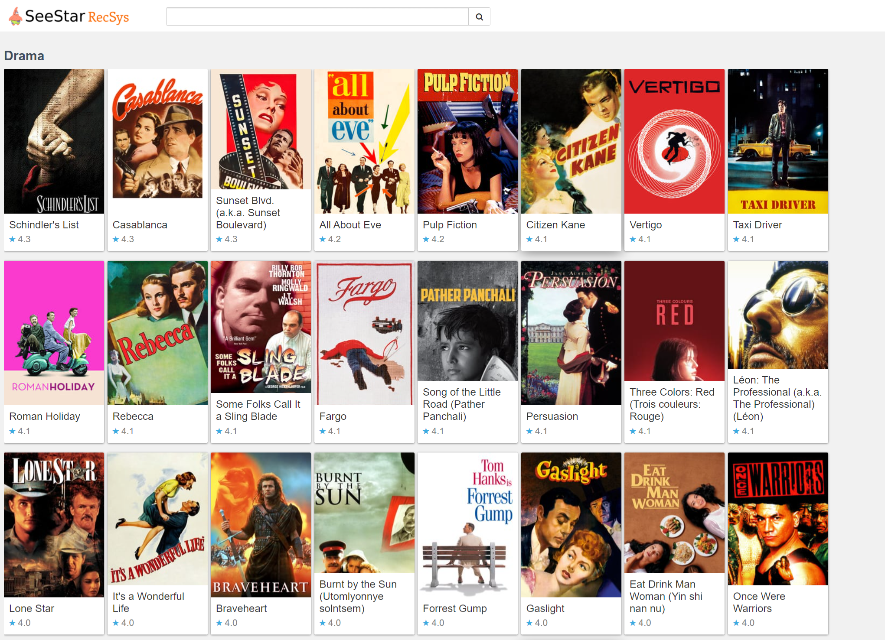
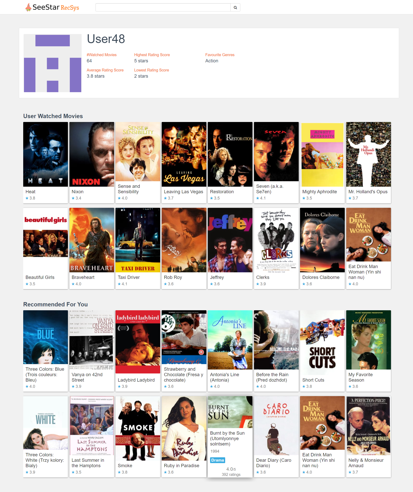
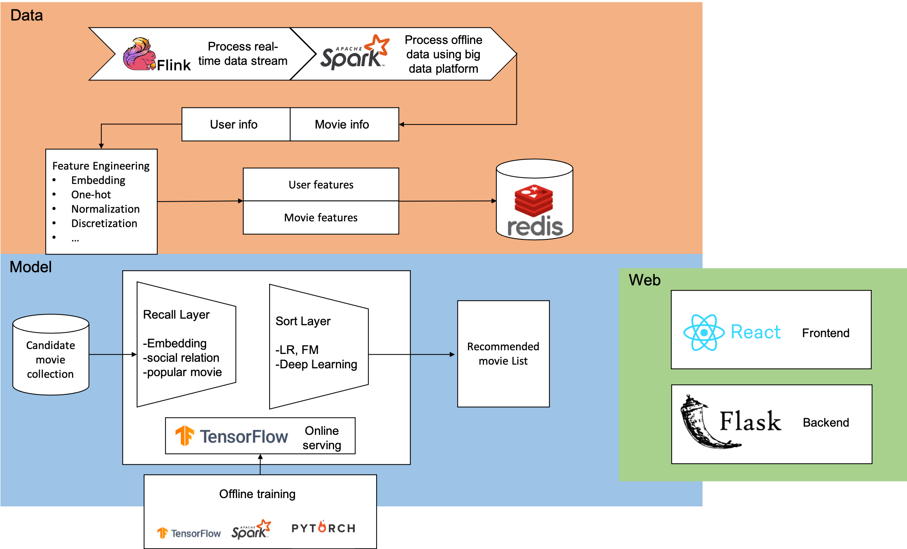

# Elastic-and-Parallel-Rec-System-pipeline
Elastic recommendation system is serving for the course project for CSCI 596.

The main purpose is to use parallel computing ideas in the course to improve the performance of original monolithic client server recommendation system

## Challenges
1. Server is the bottleneck for client inquiries

2. Model training convergence speed restricted by single machine nature

## Objectives
1. Build an elastic system to handle numerous client's requests

2. Use parallel techniques to speed up the model training time

## How to Run
You can use the following command to start the server easily and checkout the home page at http://127.0.0.1:5000
```shell script
python online/rec_sys_server.py
```

## Techniques
### Spark
We used Spark to do the offline training, which is a lightning-fast cluster computing technology. It is based on Hadoop 
MapReduce, a famous parallel computing technique, and extends MapReduce to do more kinds of computation. In this project,
we used an open source movie dataset named [MovieLens](https://grouplens.org/datasets/movielens/) to build a recommendation system. We exploited a Spark package in python called pyspark to train
 a model parallel in order to accelerate model training. To be specific, our recommendation system is based on similarity. 
 Word2vec and randomwalk are utilized to generate user embedding and movie embedding, which can be applied to calculate 
 cosine similarity and recommend those movies with higher similarity to users based on user's browse and rating history.
 
### Flask
Flask is a micro framework in Python and we employed Flask as our backend system. Flask is a very fast and simple system 
and it can extend different packages easily. In this case, we are able to combine various parallel framework with Flask.
For example, we can assemble Flink, Tensorflow and Pytorch to process stream data and train a deep learning model 
parallel in an easy way. 

Also, it is easy to handle numerous requests in Flask since Flask can process requests in an asynchronous way. Flask 
can work with nginx to do the reverse proxy as well as cooperate with Celery to do the asynchronous tasks.

### React
We developed our front-end with React framework.

React is a declarative, efficient, and flexible open-source JavaScript library for building user interfaces.
It lets you compose complex UIs from reusable small and isolated pieces of code called “components”.

React is composed of several important features: JSX, React native, single-way data flow, and virtual document object model (DOM).
The main purpose of React is to be fast, scalable, and simple.
 

 

#### Modules
The front-end of our system consists of four modules: homepage (index), movie, genre collection, and user.

#### Homepage
The homepage is the entrance of our system. It displays generally popular movies of different genres and provides you search bars to do more customized search.
You can also click into a specific movie or genre you are interested in so that we can make more customized recommendations to you later.



#### Movie
It shows information of a specific movie and recommends you with related movies we think you might be interested in.



#### Genre Collection
The genre collection page lists top movies in a specific genre that we think you are most likely to be interested in, based on your profile and our recommendation algorithms.



#### User
This page shows information of a user, including his/her movie preference and his watching and rating history, and gives you a list of recommended movies based on the user's profile and the similarity between you and his/her.




## Structure
The following picture illustrates the structure of this project. Please note that the Flink part is still under developing.



## Contribution
Zihang Zeng: 
1. Implement offline training model and backend system
2. Integrate frontend and backend system
3. Finish corresponding parts in README file and draw a picture for the whole structure

Cheng-Tsung Liu
1. Implement part of the online services (data manager related part).
2. Implement the front-end, find resources and make the logo.
3. Write documentation for the front-end part.

